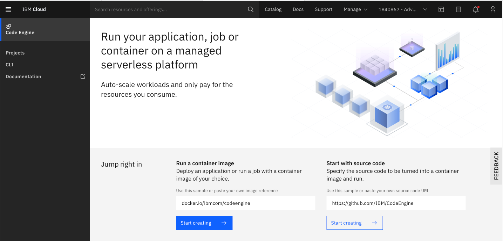
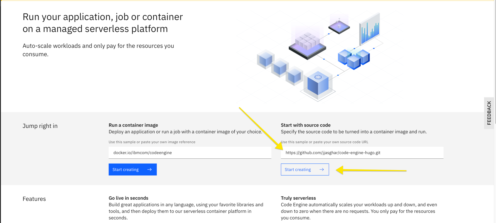
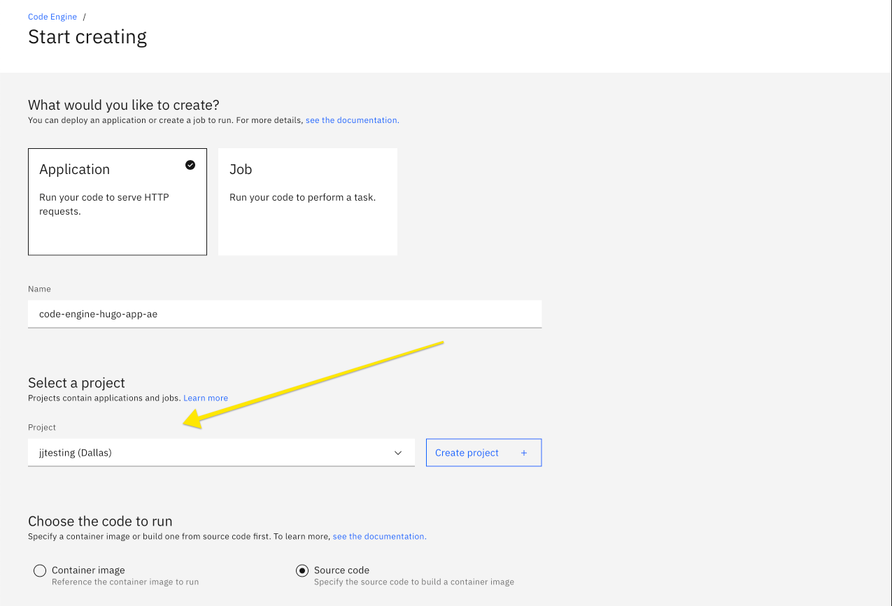

# code-engine hugo

# Scope

This is a tutorial/demo of getting [hugo][mainhugo] to work with [code-engine][codeengine] 
from IBM Cloud.

# Prerequiesits

1. You need hugo installed, there's a few different installation paths, check [this][hugo] out.
1. Create a [GitHub][githubnew] repostiory that you can push your `hugo` site to.

# Steps

## `hugo` static site generator

1. First thing you need to do is create a example hugo site, you run the following command:
**NOTE**: `code-engine-hugo` is just an example name
```bash
$ hugo new site code-engine-hugo
Congratulations! Your new Hugo site is created in /code-engine-hugo.

Just a few more steps and you're ready to go:

1. Download a theme into the same-named folder.
   Choose a theme from https://themes.gohugo.io/ or
   create your own with the "hugo new theme <THEMENAME>" command.
2. Perhaps you want to add some content. You can add single files
   with "hugo new <SECTIONNAME>/<FILENAME>.<FORMAT>".
3. Start the built-in live server via "hugo server".

Visit https://gohugo.io/ for quickstart guide and full documentation.
```

2. Next test your site and create a `git` repository, follow these next directions:
```bash
$ cd /code-engine-hugo
$ git init
$ git submodule add https://github.com/budparr/gohugo-theme-ananke.git themes/ananke
$ echo theme = \"ananke\" >> config.toml
$ hugo new posts/my-first-post.md 
$ vim content/posts/my-first-post.md # just fill it with dummy text
$ hugo server -D
```
You should be able to see a site that says "My New Hugo Site". The `my-first-post.md`
has a `draft: true`, when you want to make it real change that to `false`.

3. Now when you make changes or add posts you can run `hugo` (without drafts) and the new site
will be recreated in `public/` in that directory.

4. Push your new site up to the GitHub repository and create the Dockerfile, and we'll start configuring 
code engine next.

```bash
$ cd /code-engine-hugo
$ cat << EOF >> Dockerfile
FROM klakegg/hugo:latest

ADD . /src

EXPOSE 8080

ENTRYPOINT ["hugo", "server", "--port", "8080"]
EOF
$ git add .
$ git commit -m "inital commit"
$ git push origin main
```

5. Just as a sanity check, lets verify that the container we have/built will work locally. Run
the following commands and to test it:

```bash
$ docker build -t jjasghar/code-engine-hugo-example .
$ docker run -it --rm -p 8080:8080 jjasghar/code-engine-hugo-example:latest server
Start building sites …

                   | EN
-------------------+-----
  Pages            |  7
  Paginator pages  |  0
  Non-page files   |  0
  Static files     |  1
  Processed images |  0
  Aliases          |  0
  Sitemaps         |  1
  Cleaned          |  0

Built in 23 ms
Watching for changes in /src/{archetypes,content,data,layouts,static,themes}
Watching for config changes in /src/config.toml, /src/themes/ananke/config.yaml
Environment: "DEV"
Serving pages from memory
Running in Fast Render Mode. For full rebuilds on change: hugo server --disableFastRender
Web Server is available at http://localhost:1313/ (bind address 0.0.0.0)
Press Ctrl+C to stop

# In another terminal/webbrowser:
$ open localhost:8080
```

## code-engine serverless platform

1. Now that we have our repository on GitHub, login to the [IBM Cloud][ibmcloud]
console.


2. You should come to the [overview][codeengine-overview] page.


3. Now take your repository from above and add it to the "Start with source code"
entry box.

And click "Start creating"

4. If you haven't created a project yet, create one where I'm pointing to, or select
one like I have as "jjtesting".


5. Scroll down and click the "Specifiy build details" and put in `/` as your
root directory. `hugo` needs to be able to find the `config.toml` file.

6. You'll need to make sure it can see your `Dockerfile` and add your credentails
to Docker Hub. This will create a repository for you and push this container to it.

7. Click "Done", and "Create."

Now if you open up the application URL you should have the `hugo` site!

## License & Authors

If you would like to see the detailed LICENSE click [here](./LICENSE).

- Author: JJ Asghar <awesome@ibm.com>

```text
Copyright:: 2021- IBM, Inc

Licensed under the Apache License, Version 2.0 (the "License");
you may not use this file except in compliance with the License.
You may obtain a copy of the License at

http://www.apache.org/licenses/LICENSE-2.0

Unless required by applicable law or agreed to in writing, software
distributed under the License is distributed on an "AS IS" BASIS,
WITHOUT WARRANTIES OR CONDITIONS OF ANY KIND, either express or implied.
See the License for the specific language governing permissions and
limitations under the License.
```


[codeengine]: https://www.ibm.com/cloud/code-engine
[codeengines-overview]: https://cloud.ibm.com/codeengine/overview
[hugo]: https://gohugo.io/getting-started/installing/
[ibmcloud]: https://cloud.ibm.com
[mainhugo]: https://gohugo.io/
[githubnew]: https://github.com/new
